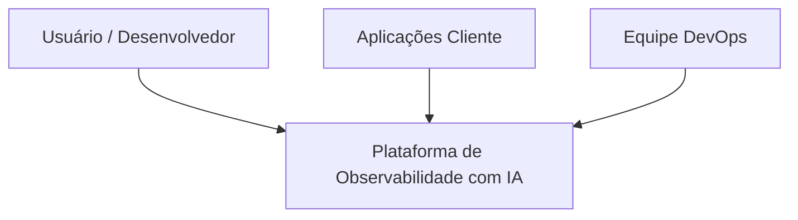
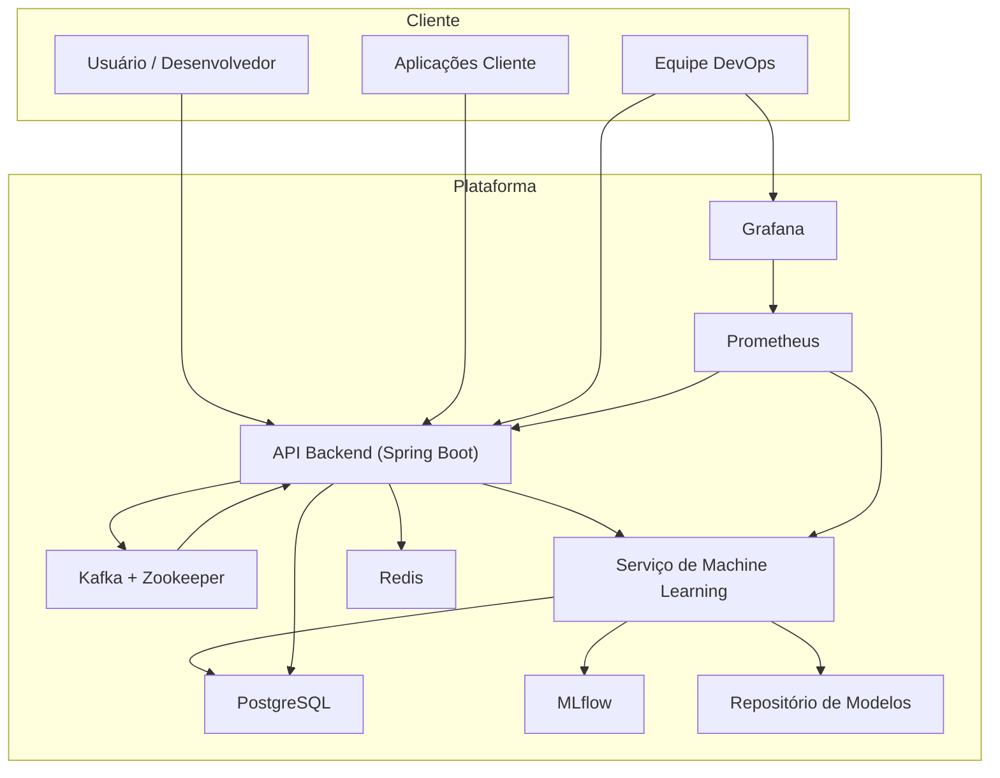
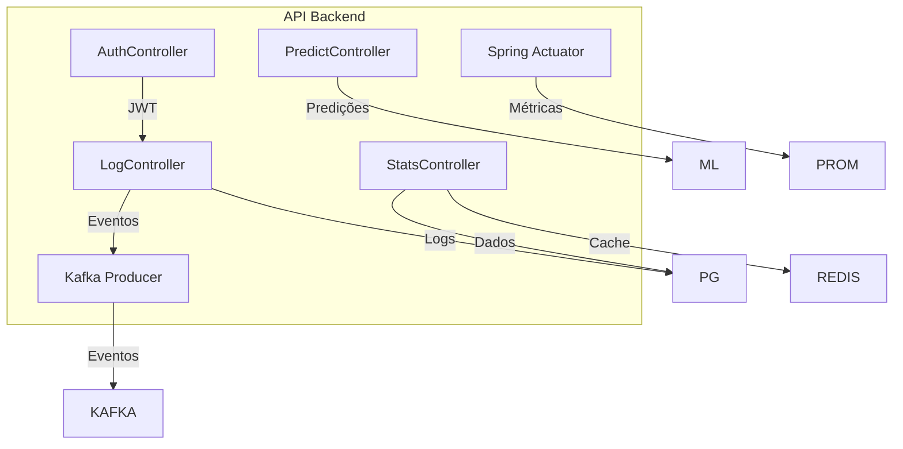

# Plataforma de Observabilidade Inteligente com Machine Learning
## Visão Geral

Esta aplicação implementa uma plataforma de observabilidade avançada, capaz de coletar logs, gerar métricas operacionais, realizar previsões de falhas e detectar anomalias em sistemas distribuídos.

A plataforma combina tecnologias modernas de microserviços, processamento de eventos e Machine Learning para fornecer observabilidade preditiva, permitindo antecipar problemas operacionais antes que eles impactem o sistema.

**Principais capacidades:**
* Coleta centralizada de logs
* Análise de métricas operacionais
* Predição de erros
* Previsão de latência
* Detecção de anomalias
* Monitoramento de drift de dados
* Dashboards operacionais em tempo real

## Arquitetura do Sistema

A arquitetura segue princípios modernos de engenharia de software:
* Microservices Architecture
* Event Driven Architecture
* Machine Learning Platform
* Observability Stack

Essa abordagem permite escalabilidade, desacoplamento e evolução contínua dos serviços.

## Tecnologias Utilizadas

### Backend
* Java
* Spring Boot
* Spring Security
* Spring Actuator

### Streaming de Eventos
* Apache Kafka
* Zookeeper

### Machine Learning
* Python
* FastAPI
* MLflow

### Persistência
* PostgreSQL
* Redis

### Observabilidade
* Prometheus
* Grafana

## Arquitetura utilizando C4 Model

A documentação arquitetural segue o C4 Model, que descreve sistemas em quatro níveis:

| Nível | Descrição          |
|----|-----------------------|
| C1 | Contexto do sistema   |
| C2 | Containers / Serviços |
| C3 | Componentes internos  |
| C4 | Código                |

### C1 — System Context Diagram

O System Context Diagram apresenta a interação entre os usuários e o sistema.

Usuários podem:
* enviar logs
* consultar métricas
* solicitar previsões
* acessar dashboards operacionais

### C2 — Container Diagram (Arquitetura de Containers)

O Container Diagram apresenta os serviços executáveis que compõem a plataforma.

#### Componentes

**API Backend (Spring Boot)**
* Ponto de entrada da plataforma
* Autenticação JWT
* Ingestão de logs
* Geração de estatísticas
* Solicitação de predições
* Publicação de eventos no Kafka
* Métricas via Spring Actuator

**Plataforma de Streaming (Kafka + Zookeeper)**
* Desacoplamento entre serviços
* Processamento assíncrono
* Escalabilidade
* Kafka Consumer para processamento de eventos

**Serviço de Machine Learning (Python)**
* Previsão de erros
* Previsão de latência
* Detecção de anomalias
* Monitoramento de drift de dados
* Endpoint de treinamento

**Camada de Dados**
* PostgreSQL: logs históricos, métricas, dados de treinamento
* Redis: cache de alta performance
* MLflow: rastreamento de experimentos e versionamento de modelos
* Repositório de Modelos: diretório para modelos treinados

**Stack de Observabilidade**
* Prometheus: coleta métricas da API e do serviço de ML
* Grafana: dashboards operacionais

### C3 — Component Diagram (Arquitetura Interna da API)

Detalhes dos componentes internos da API Spring Boot.

#### Componentes

**AuthController**
* Autenticação JWT
* Proteção de endpoints

**LogController**
* Ingestão de logs
* Persistência no PostgreSQL
* Publicação de eventos no Kafka

**StatsController**
* Geração de estatísticas
* Uso de Redis como cache

**PredictController**
* Interface com serviço de ML
* Predição de erros
* Predição de latência

**Kafka Producer**
* Publicação de eventos
* Desacoplamento de serviços

**Spring Actuator**
* Métricas técnicas
* Health checks

## Fluxos Operacionais

### Fluxo de Ingestão de Logs
* Aplicações enviam logs para a API
* LogController persiste no PostgreSQL
* Eventos são publicados no Kafka
* Kafka Consumer processa e armazena dados adicionais

### Fluxo de Estatísticas
* API consulta Redis
* Se ocorrer cache miss, consulta PostgreSQL
* Resultado é armazenado em cache

### Fluxo de Predição
* Cliente solicita predição
* PredictController envia para o serviço de ML
* Modelo treinado é carregado
* Previsão é retornada

### Pipeline de Machine Learning
* Dados históricos coletados do PostgreSQL
* Modelo é treinado
* Experimentos registrados no MLflow
* Modelo salvo no repositório

### Monitoramento
* Prometheus coleta métricas da API e do serviço de ML
* Grafana apresenta dashboards operacionais

## Benefícios Arquiteturais
* Escalabilidade através do Kafka
* Desacoplamento via event-driven architecture
* Inteligência operacional com machine learning
* Observabilidade completa com Prometheus e Grafana

## Conclusão

Esta plataforma representa uma evolução da observabilidade tradicional, combinando:
* APIs REST
* Processamento assíncrono
* Pipelines de Machine Learning
* Monitoramento avançado

O resultado é um sistema capaz de antecipar problemas operacionais e fornecer inteligência preditiva para aplicações distribuídas.

## Explicação Técnica de Cada Implementação e Importância para o Mercado

### 1. Spring Boot & Hexagonal Architecture
*   **Implementação:** A API Java foi estruturada isolando a lógica de negócio (Domínio) através de Portas e Adaptadores, com forte injeção de dependências e anotações limpas.
*   **Importância para o Mercado:** Projetos reais exigem sustentabilidade e facilidade de manutenção a longo prazo. A Clean Architecture permite trocar tecnologias de infraestrutura (banco de dados, mensageira) sem refatorar regras de negócio, reduzindo custos e acelerando integrações.

### 2. Microserviço em Python  (FastAPI) para Machine Learning
*   **Implementação:** ML separado em um microserviço robusto usando FastAPI, que expõe modelos treinados de Classification (probabilidade de erro), Regression (tempo de resposta) e detecção de anomalias (z-score e isolation forest), com rastreio pelo MLflow.
*   **Importância para o Mercado:** Arquiteturas em microsserviços permitem alocar recursos em frentes específicas. O ML Service é leve e altamente escalável para previsões em tempo real. No mercado atual, AIOps (Artificial Intelligence for IT Operations) é uma exigência urgente; prevenir quedas de serviços financeiros ou de e-commerce economiza milhões em receita por minuto.

### 3. Mensageria Assíncrona com Apache Kafka
*   **Implementação:** Logs capturados via API são disparados via produtor Kafka, onde consumidores processam sob a demanda, mitigando picos de tráfego (Backpressure).
*   **Importância para o Mercado:** Sistemas de alto volume não podem travar sincronamente. O Apache Kafka é um padrão obrigatório para processamento de alto throughput (centenas de milhares de requisições/s). Saber implementar stream de dados é o principal diferencial em Big Data e sistemas de observabilidade de Big Techs.

### 4. Cache em Memória com Redis
*   **Implementação:** As consultas estatísticas (`/api/stats/summary`) utilizam cache via Redis para evitar onerar o banco de dados principal.
*   **Importância para o Mercado:** Performance é essencial. Chamadas de relatórios complexos diretas na base de dados (PostgreSQL) degradam a experiência. Redis permite servir painéis com latência de milissegundos, fundamental para monitoramentos em tempo real e de nível enterprise.

### 5. Monitoramento contínuo: Prometheus, Grafana e Data Drift (Evidently)
*   **Implementação:** Autoinstrumentação via Actuator/Prometheus exportando requisições por segundo e taxas de erro; painéis Grafana configurados. Avaliação diária sobre Data Drift nos logs usando *Evidently AI*.
*   **Importância para o Mercado:** Entregar o sistema não é suficiente. *Site Reliability Engineering* (SRE) foca em "ver" a aplicação. Adicionalmente, modelos de IA sofrem obsolescência ("model decay" ou drift), o mercado procura *MLOps* para garantir que previsões em produção permaneçam exatas ao longo do tempo. Esse sistema automatiza até o retreinamento se ocorrer Data Drift.
