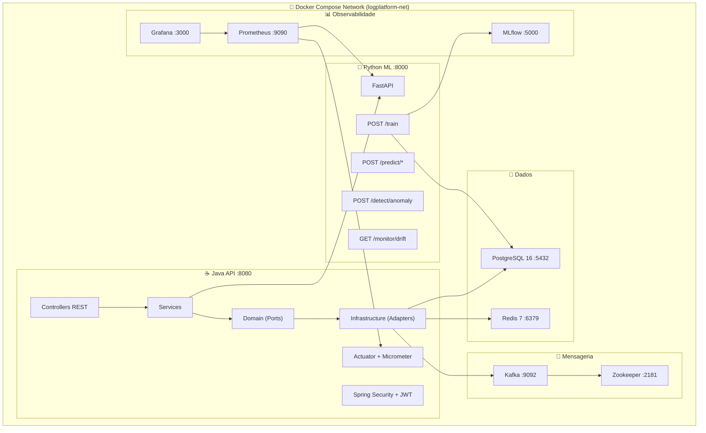

# 📘 Guia Mestre: Predictive Log Intelligence Platform

Este documento é o manual definitivo da aplicação. Ele explica a arquitetura final, como cada componente funciona na prática e como operar toda a plataforma.

---

## 🏗️ Visão Geral da Arquitetura



---

## 🛠️ Como Utilizar a Plataforma

### 1. Inicialização Total (Docker)
```bash
docker-compose up --build -d
```

### 2. Fluxo Operacional Padrão

#### **Passo A — Gerar Dataset Sintético**
```bash
curl -X POST http://localhost:8000/generate-dataset
```

#### **Passo B — Treinar os Modelos de ML**
```bash
curl -X POST http://localhost:8000/train
```

#### **Passo C — Upload de Logs para o Java**
```bash
curl -F "file=@data/web_logs.csv" http://localhost:8080/logs/upload
```

#### **Passo D — Predição de Erro**
```bash
curl -X POST http://localhost:8080/predict/error \
  -H "Content-Type: application/json" \
  -d '{"method":"GET","hour":14,"historicalAvgResponse":250}'
```

#### **Passo E — Predição de Tempo de Resposta**
```bash
curl -X POST http://localhost:8080/predict/response-time \
  -H "Content-Type: application/json" \
  -d '{"method":"POST","hour":10,"historicalAvgResponse":300}'
```

#### **Passo F — Detecção de Anomalia**
```bash
curl -X POST http://localhost:8000/detect/anomaly \
  -H "Content-Type: application/json" \
  -d '{"response_time_ms":15000,"method":"GET","hour":3}'
```

---

## 🧩 Como Cada Componente Funciona na Plataforma

### ⚡ Redis Cache — Aceleração de Respostas
O Redis atua como **cache em memória** entre a API Java e o banco de dados. Quando uma consulta pesada (como estatísticas ou predições) é feita, o resultado é armazenado no Redis para evitar recalcular nas próximas chamadas.

**Como funciona no código:**
- A classe `RedisConfig.java` define dois caches com TTLs diferentes:
  - `predictions` → TTL de **5 minutos** (predições não mudam com frequência)
  - `statistics` → TTL de **30 segundos** (dados estatísticos são mais voláteis)
- O `StatisticsService.java` usa a anotação `@Cacheable(value = "statistics", key = "'summary'")`. Isso significa que a primeira chamada a `GET /stats/summary` calcula do banco, mas as próximas 30 segundos retornam instantaneamente do Redis.
- A serialização usa JSON (`GenericJackson2JsonRedisSerializer`), permitindo inspeção dos dados no Redis.

**Acesso:** `localhost:6379` (conexão direta via `redis-cli` ou RedisInsight).

---

### 📨 Apache Kafka — Pipeline de Eventos em Tempo Real
O Kafka processa os logs como **eventos assíncronos**, permitindo que a ingestão de dados seja desacoplada do processamento.

**Como funciona no código:**
- **Producer** (`LogEventProducer.java`): Após o upload de CSV, cada log é publicado no tópico `plip.logs.raw` com a chave sendo o método HTTP (GET, POST, etc.). Isso permite particionamento por tipo de requisição.
- **Consumer** (`LogEventConsumer.java`): Consome do tópico `plip.logs.raw` no grupo `plip-log-consumer`, desserializa o JSON para `WebLogDomain` e persiste via `LogRepository`. Logs com status >= 400 geram um warning no console.
- **Streams** (`LogStreamProcessor.java`): Processamento de stream sobre os eventos brutos para análises em tempo real.

**Infraestrutura:** Kafka (`localhost:9092`) + Zookeeper (`localhost:2181`). Tópicos são auto-criados.

---

### 📊 Grafana — Dashboards de Observabilidade
O Grafana exibe **dashboards visuais** com métricas coletadas pelo Prometheus, permitindo monitorar a saúde da plataforma em tempo real.

**Como funciona na configuração:**
- **Datasource provisionado automaticamente**: O arquivo `grafana/provisioning/datasources/prometheus.yml` conecta o Grafana ao Prometheus (`http://prometheus:9090`) na inicialização — sem configuração manual.
- **Dashboard pré-carregado**: O arquivo `grafana/dashboards/plip-overview.json` contém um dashboard completo (PLIP Overview) que é carregado automaticamente via provisionamento (`grafana/provisioning/dashboards/dashboard.yml`).
- **Métricas disponíveis**:
  - `ml.inference.latency` — Latência das inferências de ML
  - `ml.predictions.total` — Volume total de predições
  - `http.server.requests` — Requisições HTTP da API Java
  - Métricas do FastAPI Python via `/metrics`

**Acesso:** `http://localhost:3000` → Login: `admin` / Senha: `admin`

---

### 📈 Prometheus — Coleta de Métricas
O Prometheus **coleta métricas** de todos os serviços a cada 15 segundos e as armazena em formato de séries temporais.

**Como funciona na configuração (`prometheus.yml`):**
- **Java API**: Scrape em `java-api:8080/actuator/prometheus` (Spring Actuator + Micrometer)
- **Python ML**: Scrape em `python-ml:8000/metrics` (prometheus-fastapi-instrumentator)
- **Self-monitoring**: Prometheus monitora a si mesmo em `localhost:9090`

**Acesso:** `http://localhost:9090` → Interface de consultas PromQL.

---

### 📦 MLflow — Governança de Modelos de IA
O MLflow **versiona** cada treinamento dos modelos, registrando métricas, parâmetros e artefatos.

**Como funciona:**
- Cada chamada a `POST /train` cria uma **Run** no MLflow com:
  - **Parâmetros**: Hiperparâmetros de cada modelo (n_estimators, max_depth, etc.)
  - **Métricas**: ROC-AUC, F1-score, RMSE, R², MAE
  - **Artefatos**: Arquivos `.joblib` dos modelos, gráficos (ROC curve, SHAP, etc.)
- O melhor modelo é automaticamente selecionado e salvo no volume compartilhado `/models`.

**Acesso:** `http://localhost:5000` → Interface de rastreamento de experimentos.

---

### 🗄️ PostgreSQL — Persistência Central
O PostgreSQL armazena **todos os dados estruturados** da plataforma.

**Tabelas principais:**
- `web_logs` — Logs HTTP ingeridos (método, path, status, response_time)
- `predictions` — Histórico de predições feitas pela IA (tipo, input, resultado)

**Inicialização:** O schema é criado automaticamente via `postgres/init.sql` + Hibernate `ddl-auto: update`.

**Acesso:** `localhost:5432` → DB: `logplatform` / User: `logadmin` / Pass: `logadmin123`

---

### 🔐 Spring Security + JWT — Autenticação
A API Java usa **JWT (JSON Web Token)** para proteger endpoints sensíveis.

**Como funciona:**
- Endpoint de login: `POST /auth/login` com `{"username":"admin","password":"admin123"}`
- O token JWT retornado deve ser enviado como `Authorization: Bearer <token>` nas requisições protegidas.
- TTL do token: 24 horas (configurável via `JWT_EXPIRATION_MS`).
- Endpoints liberados sem autenticação: Swagger, Actuator, Health.

---

### 🐳 Docker Compose — Orquestração Completa
O `docker-compose.yml` orquestra **9 containers** em uma rede isolada (`logplatform-net`):

| Container | Porta | Função |
|-----------|-------|--------|
| `plip-postgres` | 5432 | Banco de dados relacional |
| `plip-redis` | 6379 | Cache em memória |
| `plip-kafka` | 9092 | Broker de mensageria |
| `plip-zookeeper` | 2181 | Coordenação do Kafka |
| `plip-python-ml` | 8000 | Serviço de Machine Learning |
| `plip-mlflow` | 5000 | Tracking de modelos |
| `plip-java-api` | 8080 | API REST principal |
| `plip-prometheus` | 9090 | Coleta de métricas |
| `plip-grafana` | 3000 | Dashboards visuais |

**Dependências automáticas:** O Java só sobe após o PostgreSQL estar saudável e o Python ML estar iniciado. O Grafana depende do Prometheus, que depende dos serviços.

---

## 📡 Referência Rápida de URLs

| Serviço | URL | Descrição |
|---------|-----|-----------|
| Swagger UI | http://localhost:8080/swagger-ui.html | Documentação interativa da API |
| FastAPI Docs | http://localhost:8000/docs | Documentação do serviço ML |
| Grafana | http://localhost:3000 | Dashboards (admin/admin) |
| MLflow | http://localhost:5000 | Tracking de experimentos |
| Prometheus | http://localhost:9090 | Métricas e queries |
| Actuator Health | http://localhost:8080/actuator/health | Saúde do Java API |
| Drift Monitor | http://localhost:8000/monitor/drift | Monitoramento de data drift |

---

## 🧪 Testes

### Python
```bash
cd python-ml-service
pip install -r requirements.txt
python -m pytest tests/ -v --tb=short
```

### Java
```bash
cd java-api
mvn test
```

### Cobertura (Java)
```bash
cd java-api
mvn test jacoco:report
# Relatório em target/site/jacoco/index.html
```
