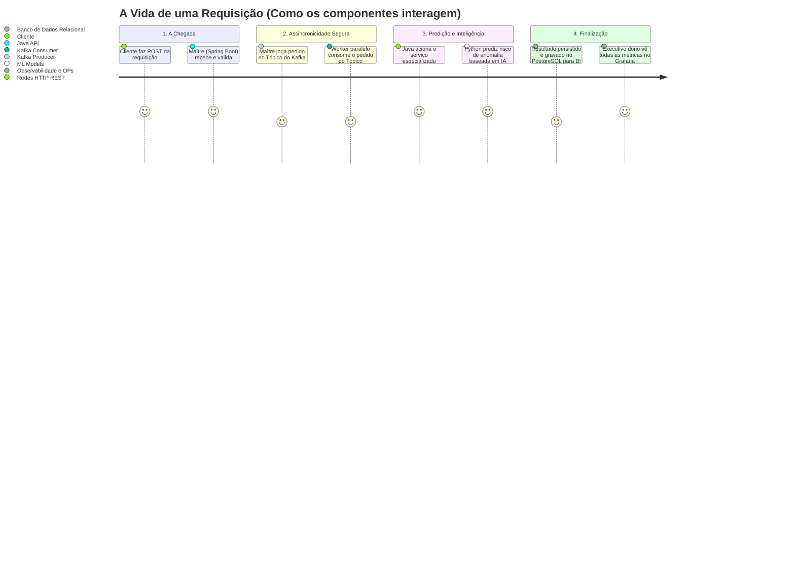

# Guia Didático: Como Ensinar e Aprender a Plataforma

Bem-vindo ao guia pedagógico da **Plataforma de Inteligência Preditiva de Logs**. Este  umento foi desenhado para facilitar o ensino e a curva de aprendizado de arquiteturas complexas modernas (Microserviços, Mensageria, Machine Learning, MLOps e Observabilidade).

Para tornar conceitos altamente abstratos em algo palpável, utilizaremos **Analogias do Mundo Real**, especificamente a **Analogia de um Mega Restaurante de Alta Gastronomia**.

---

## 🍽️ A Grande Analogia: O Restaurante Inteligente

Imagine que a nossa plataforma não processa "logs de TI", mas sim **pedidos de clientes em um restaurante extremamente movimentado**.

O objetivo do restaurante é:
1. Receber os pedidos (Logs).
2. Preparar os pratos (Processamento).
3. Prever se um prato vai dar problema ou demorar muito, antes mesmo de ser feito (Machine Learning).
4. Monitorar o salão e a cozinha em tempo real (Observabilidade).

Abaixo, correlacionamos cada componente tecnológico a um elemento do restaurante:

| Tecnologia | Papel na Plataforma | O que seria no Restaurante | Explicação Didática |
| :--- | :--- | :--- | :--- |
| **Spring Boot (Java)** | Orquestrador da API | **O Maître (Gerente do Salão)** | Fica na porta recebendo os clientes (logs). Ele é rápido, confiável e segue regras estritas de negócio. Ele não cozinha, apenas anota os pedidos e distribui as tarefas. |
| **Apache Kafka** | Mensageria assíncrona | **A Esteira de Comandas** | Se 1000 clientes chegarem juntos, o Maître não pode ir à cozinha falar com o Chef para cada um. Ele coloca os pedidos numa *esteira infinita* (Kafka). A cozinha pega os pedidos no próprio ritmo, evitando que o restaurante entre em colapso. |
| **FastAPI (Python)** | Serviço de Inteligência Artificial | **O Consultor Especialista (Sommelier/Estatístico)** | Um especialista numa sala separada. O Maître pergunta a ele: *"Esse cliente pediu o prato X com a bebida Y. Qual a chance dele reclamar?"*. O especialista usa estatística pura (Modelos de ML) para responder em milissegundos. |
| **Redis** | Cache em memória | **O Bloquinho do Garçom** | Respostas muito frequentes não precisam ir ao arquivo morto. O Garçom anota no braço ou no bloquinho de acesso imediato (memória RAM) para responder instantaneamente qual é o prato do dia. |
| **PostgreSQL** | Banco de Dados Relacional | **O Arquivo Seguro / Estoque** | Onde todas as comandas, receitas e faturamentos são guardados para a eternidade. É mais lento que o bloquinho do garçom, mas é à prova de falhas e estruturado. |
| **Prometheus & Grafana**| Monitoramento e Observabilidade | **O Painel de Câmeras de Segurança** | Em vez de andar pela cozinha perguntando se tudo está bem, o dono do restaurante senta numa sala cheia de monitores (Grafana) que mostram em gráficos se a panela está muito quente ou se a fila de clientes está grande. |
| **MLflow & Evidently** | MLOps e Monitoramento de IA | **O Laboratório de Qualidade** | O chef anota todas as suas experiências com novas receitas num livro (MLflow). O *Evidently* é o provador que percebe se o gosto dos clientes mudou com o tempo (Data Drift) e avisa que é preciso criar modelos de IA (receitas) novos. |

---

## 🗺️ Mapa de Ensino: A Trilha do Aluno (Construção Evolutiva)

Para ensinar (ou aprender) a construir essa arquitetura do zero, **não** se deve apresentar tudo de uma vez. A abordagem mais eficaz é a **construção evolutiva**, inserindo problemas e resolvendo-os com as ferramentas adequadas.

### Módulo 1: O Monólito Essencial (Criando o Básico)
* **Objetivo:** Entender a base da programação backend e a persistência de dados.
* **Ação:** O aluno cria apenas a API em **Spring Boot** conectada diretamente ao **PostgreSQL**.
* **O Problema Simulado:** Crie um endpoint que receba um log em JSON e salve na tabela. 
* **O que se aprende:** Arquitetura Hexagonal, Ports & Adapters, Spring Data JPA, Endpoints REST.

### Fase 2: O Caos do Tráfego e a Queda do Monólito (O Código Didático)
* **A Crise (O Problema):** Dispare 50.000 requisições simultâneas para o Spring Boot criado no Módulo 1. O banco de dados (PostgreSQL) vai estourar o limite de conexões e a aplicação vai cair com `Timeout` ou `OutOfMemoryError`. 
  * 👉 *Dica de Ouro Pro Instrutor:* Nós fornecemos um script Python na pasta `/scripts_didaticos/crash_api_simulator.py`. Rode ele ao vivo com o token gerado pelo Java e observe os logs do PostgreSQL morrerem em tempo real ("`FATAL: sorry, too many clients already`"). É a prova prática de que não dá para viver sem Kafka.
* **A Solução:** Introduzir o **Apache Kafka**. O aluno refatora o fluxo: o Spring Boot agora apenas salva a mensagem no Kafka e retorna "OK" para o usuário. Outro serviço (Consumer) lê o Kafka e salva no PostgreSQL devagar, sem gargalo.
* **O que se aprende:** Assincronicidade, Produtores, Consumidores, Tópicos, Resiliência, *Backpressure*.

### Módulo 3: O Cérebro da Operação (Adicionando Machine Learning)
* **A Crise (O Problema):** Temos milhões de logs guardados, mas não sabemos como usá-los para prever lentidões ou anomalias no sistema. Não dá para rodar IA pesada em Java.
* **A Solução:** Criar um microserviço à parte em **Python (FastAPI)**. O aluno cria scripts para treinar modelos usando `scikit-learn`. O microserviço Java agora faz uma requisição HTTP para o Python consultando o modelo.
* **O que se aprende:** Treinamento de Regressão Logística e Isolation Forest, APIs em Python, Integração Polyglota (Java chamando Python, o que demonstra maturidade arquitetural).

### Módulo 4: O Controle do Caos (A Camada Ops e SRE)
* **A Crise (O Problema):** A plataforma está no ar, mas quando algo dá errado, precisamos olhar arquivos de texto (logs) perdidos em servidores. Como saber se o modelo de IA ainda está acertando as predições? Ele perdeu validade?
* **A Solução:** Subir **Prometheus e Grafana** para monitorar a saúde da CPU e métricas de negócio. Usar o **MLflow** para versionar modelos e o **Redis** para deixar tudo incrivelmente mais rápido e evitar re-processamento caro no banco.
* **O que se aprende:** SRE (Site Reliability Engineering), MLOps, Caching, Rastreabilidade de Experimentos, Métricas, *Scrapes*, e Criação de Dashboards executivos.

---

## 💡 Dicas de Didática Exclusivas para o Instrutor

1. **Quebre a Aplicação Propositalmente:** A melhor ferramenta didática é fazer o sistema falhar. Mostre uma requisição falhando por lentidão extrema no banco de dados ANTES de introduzir o controle com Kafka. Mostre uma predição errada antes de introduzir o retreinamento com novos dados. O aluno precisa sentir a "dor" de negócios para valorizar o "remédio" tecnológico.
2. **Use Diagramas e Objetos Físicos:** Se estiver presencial, use post-its na lousa movendo o "log" pelas etapas.
3. **Debug Cruzado Entre Serviços:** Um divisor de águas é ensinar o aluno a colocar *breakpoints* na IDE do Java e na IDE do Python ao mesmo tempo. Envie a requisição e mostre o tráfego parando no Java, viajando pela porta HTTP local, e caindo no ecossistema Python. A ficha técnica "cai" na mente do aluno na mesma hora.

---

## 📊 Arquitetura Dinâmica em Fluxo (Para o Aluno Visualizar)

---
*Este guia visa transformar o ensino e aprendizado da engenharia de software avançada (Big Data + Cloud Architecture + IA) em uma experiência intuitiva, lúdica e visual, combinando a robustez processual das pilhas corporativas (Java) com a agilidade científica (Python).*
