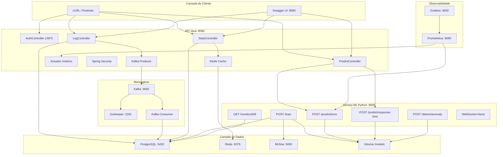
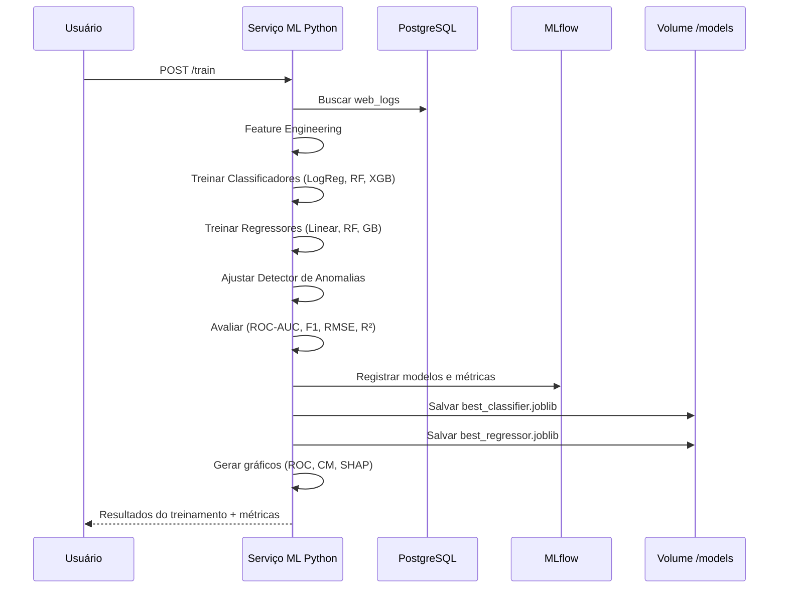
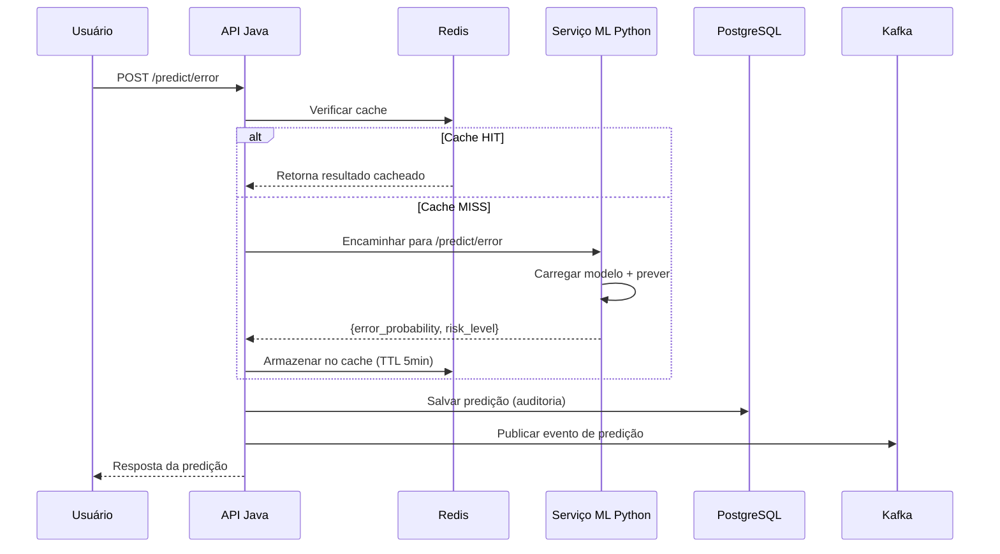

# 🔮 Predictive Log Intelligence Platform

> Plataforma distribuída de nível enterprise para ingestão de logs web, análise estatística e detecção preditiva de anomalias usando Machine Learning.

---

## �️ Stack Tecnológica

### ☕ Back-end (Java)
| Tecnologia | Versão | Função |
|------------|--------|--------|
| Java | 21 LTS | Linguagem principal do back-end |
| Spring Boot | 3.2.x | Framework REST (Tomcat embutido) |
| Spring Data JPA | — | ORM com Hibernate 6 para PostgreSQL |
| Spring Security | — | Autenticação JWT Stateless |
| Spring WebFlux | — | WebClient reativo para chamadas ao Python |
| Spring Actuator + Micrometer | — | Métricas e health checks para Prometheus |
| Spring Kafka | — | Producer/Consumer/Streams para eventos de log |
| Spring Data Redis | — | Cache de predições e estatísticas |
| OpenCSV | — | Parser de CSV para upload de logs |
| Lombok | — | Redução de boilerplate |
| JaCoCo | — | Cobertura de testes |

### 🐍 Machine Learning (Python)
| Tecnologia | Versão | Função |
|------------|--------|--------|
| Python | 3.12 | Linguagem do serviço de ML |
| FastAPI + Uvicorn | — | API de alta performance (ASGI) |
| Scikit-Learn | — | Modelos clássicos (LogReg, RF, Isolation Forest) |
| XGBoost | — | Gradient Boosting para classificação |
| Pandas + NumPy | — | Manipulação de dados e cálculos |
| SciPy | — | Testes estatísticos (Kolmogorov-Smirnov) |
| Evidently AI | — | Detecção de Data Drift |
| MLflow SDK | — | Tracking de experimentos e modelos |
| Joblib | — | Serialização de modelos (.joblib) |

### 💾 Infraestrutura & Dados
| Tecnologia | Versão | Função |
|------------|--------|--------|
| PostgreSQL | 16 | Banco de dados relacional (logs + predições) |
| Redis | 7 | Cache em memória (TTL 5min predições, 30s stats) |
| Apache Kafka | 7.6.0 (Confluent) | Streaming de eventos de log em tempo real |
| Zookeeper | 7.6.0 (Confluent) | Coordenação do cluster Kafka |
| MLflow Server | — | UI de governança e versionamento de modelos |
| Prometheus | 2.51.0 | Coleta de métricas (scrape 15s) |
| Grafana | 10.4.1 | Dashboards de observabilidade |
| Docker + Docker Compose | — | Containerização e orquestração (9 containers) |

### 🔄 CI/CD (GitHub Actions)
| Workflow | Arquivo | Função |
|----------|---------|--------|
| Deploy | `deploy.yml` | Pipeline de deploy completo |
| Docker Build | `docker-build.yml` | Build e push de imagens |
| Java Tests | `java-tests.yml` | Testes unitários + JaCoCo |
| Python Tests | `python-tests.yml` | pytest + linting |

---

## �📐 Arquitetura



---

## 🧠 Fluxo de Treinamento



---

## 🔍 Fluxo de Inferência



---

## 🚀 Início Rápido

### Pré-requisitos
- Docker & Docker Compose
- (Opcional) Java 21 + Maven para desenvolvimento local da API Java
- (Opcional) Python 3.12 para desenvolvimento local do serviço ML

### Executar com Docker Compose

```bash
# Navegar até o projeto
cd predictive-log-platform

# Iniciar todos os serviços
docker-compose up --build -d

# Verificar saúde dos serviços
docker-compose ps
```

**Serviços disponíveis:**
| Serviço | URL | Descrição |
|---------|-----|-----------|
| API Java | http://localhost:8080 | API REST principal |
| Swagger UI | http://localhost:8080/swagger-ui.html | Documentação interativa |
| Serviço ML Python | http://localhost:8000/docs | Documentação FastAPI |
| MLflow | http://localhost:5000 | Tracking de modelos |
| Grafana | http://localhost:3000 | Dashboards (admin/admin) |
| Prometheus | http://localhost:9090 | Métricas e queries PromQL |
| PostgreSQL | localhost:5432 | Banco de dados |
| Redis | localhost:6379 | Cache em memória |
| Kafka | localhost:9092 | Broker de mensageria |

### Configuração Inicial (após os containers estarem rodando)

```bash
# 1. Gerar dataset sintético (5000 registros)
curl -X POST http://localhost:8000/generate-dataset

# 2. Treinar modelos de ML
curl -X POST http://localhost:8000/train

# 3. Fazer upload do CSV para a API Java
curl -F "file=@data/web_logs.csv" http://localhost:8080/logs/upload

# 4. Consultar estatísticas (cacheadas no Redis por 30s)
curl http://localhost:8080/stats/summary | python -m json.tool
```

---

## 📡 Referência da API

### API Java (porta 8080)

#### Autenticação (JWT)
```bash
curl -X POST http://localhost:8080/auth/login \
  -H "Content-Type: application/json" \
  -d '{"username":"admin","password":"admin123"}'
```

#### Upload de Logs
```bash
curl -X POST http://localhost:8080/logs/upload \
  -F "file=@data/web_logs.csv"
```

#### Consultar Estatísticas
```bash
curl http://localhost:8080/stats/summary
```
Resposta:
```json
{
  "totalRecords": 5000,
  "meanResponseTime": 285.5,
  "medianResponseTime": 220.0,
  "stdDevResponseTime": 180.3,
  "percentile95ResponseTime": 750.0,
  "errorRate": 0.14,
  "peakHour": 10,
  "peakHourCount": 350
}
```

#### Prever Probabilidade de Erro
```bash
curl -X POST http://localhost:8080/predict/error \
  -H "Content-Type: application/json" \
  -d '{"method":"GET","hour":14,"historicalAvgResponse":240}'
```
Resposta:
```json
{
  "error_probability": 0.27,
  "risk_level": "MEDIUM",
  "model_used": "xgboost",
  "inference_time_ms": 5.2
}
```

#### Prever Tempo de Resposta
```bash
curl -X POST http://localhost:8080/predict/response-time \
  -H "Content-Type: application/json" \
  -d '{"method":"POST","hour":10,"historicalAvgResponse":300}'
```
Resposta:
```json
{
  "predicted_response_time_ms": 285.5,
  "confidence_interval": {
    "lower_bound_ms": 120.0,
    "upper_bound_ms": 450.0,
    "confidence_level": 0.95
  }
}
```

### Serviço ML Python (porta 8000)

#### Treinar Modelos
```bash
curl -X POST http://localhost:8000/train
```

#### Detectar Anomalia
```bash
curl -X POST http://localhost:8000/detect/anomaly \
  -H "Content-Type: application/json" \
  -d '{"response_time_ms":15000,"method":"GET","hour":3}'
```
Resposta:
```json
{
  "is_anomaly": true,
  "score": -0.78,
  "details": {
    "z_score": {"value": 4.5, "is_anomaly": true, "threshold": 3.0},
    "isolation_forest": {"score": -0.65, "is_anomaly": true}
  }
}
```

#### Verificar Drift de Dados
```bash
curl http://localhost:8000/monitor/drift
```

#### Saúde do Modelo
```bash
curl http://localhost:8000/monitor/health
```

### Métricas e Observabilidade
```bash
# Health check
curl http://localhost:8080/actuator/health

# Métricas customizadas
curl http://localhost:8080/actuator/metrics/ml.inference.latency
curl http://localhost:8080/actuator/metrics/ml.predictions.total

# Endpoint Prometheus
curl http://localhost:8080/actuator/prometheus
```

---

## 🧪 Testes

### Testes Python
```bash
cd python-ml-service
pip install -r requirements.txt
python -m pytest tests/ -v --tb=short
```

### Testes Java
```bash
cd java-api
mvn test
```

### Relatório de Cobertura (Java)
```bash
cd java-api
mvn test jacoco:report
# Relatório em target/site/jacoco/index.html
```

---

## 📁 Estrutura do Projeto

```
predictive-log-platform/
├── .github/
│   └── workflows/
│       ├── deploy.yml                 # Pipeline de deploy
│       ├── docker-build.yml           # Build de imagens Docker
│       ├── java-tests.yml             # CI testes Java
│       └── python-tests.yml           # CI testes Python
├── data/                              # Volume compartilhado de dados
├── models/                            # Volume compartilhado de modelos (.joblib)
├── grafana/
│   ├── dashboards/
│   │   └── plip-overview.json         # Dashboard pré-carregado
│   └── provisioning/
│       ├── dashboards/
│       │   └── dashboard.yml          # Provider de dashboards
│       └── datasources/
│           └── prometheus.yml         # Datasource Prometheus (auto)
├── prometheus/
│   └── prometheus.yml                 # Config de scrape (Java + Python)
├── postgres/
│   └── init.sql                       # Schema inicial do banco
├── mlflow/
│   └── Dockerfile                     # Imagem do MLflow Server
├── scripts/
│   └── deploy.sh                      # Script de deploy
├── python-ml-service/
│   ├── Dockerfile
│   ├── requirements.txt
│   ├── app/
│   │   ├── main.py                    # Aplicação FastAPI
│   │   ├── config.py                  # Configurações
│   │   ├── dataset_generator.py       # Dados sintéticos (5000 registros)
│   │   ├── feature_engineering.py     # Pipeline de features
│   │   ├── scheduler.py              # Agendamento de retreino
│   │   ├── models/
│   │   │   ├── classifier.py         # LogReg, RF, XGBoost
│   │   │   ├── regressor.py          # Linear, RF, GradientBoosting
│   │   │   └── anomaly.py            # Z-score + Isolation Forest
│   │   ├── infrastructure/
│   │   │   ├── mlflow_tracker.py     # Integração MLflow
│   │   │   └── model_registry.py     # Registro de modelos
│   │   ├── monitoring/
│   │   │   └── drift.py              # Drift com Evidently AI
│   │   ├── visualization/
│   │   │   └── plots.py              # ROC, CM, SHAP, Feature Imp.
│   │   └── routers/
│   │       ├── train.py              # POST /train
│   │       ├── predict.py            # POST /predict/*
│   │       ├── anomaly.py            # POST /detect/anomaly
│   │       ├── monitor.py            # GET /monitor/drift + health
│   │       └── websocket.py          # WebSocket alertas tempo real
│   └── tests/
│       ├── test_pipeline.py           # Testes unitários do pipeline
│       ├── test_predict.py            # Testes de endpoints de predição
│       └── test_anomaly.py            # Testes de detecção de anomalia
├── java-api/
│   ├── Dockerfile
│   ├── pom.xml
│   └── src/
│       ├── main/
│       │   ├── java/com/logplatform/
│       │   │   ├── LogPlatformApplication.java
│       │   │   ├── domain/
│       │   │   │   ├── model/         # WebLogDomain, PredictionResult
│       │   │   │   ├── port/          # PredictionPort, LogRepository, MlServicePort
│       │   │   │   └── service/       # PredictionDomainService
│       │   │   ├── infrastructure/
│       │   │   │   ├── adapter/       # JpaPredictionAdapter, MlServiceAdapter, JpaLogAdapter
│       │   │   │   └── kafka/         # KafkaConfig, LogEventProducer, LogEventConsumer, LogStreamProcessor
│       │   │   ├── entity/            # WebLog, Prediction (JPA Entities)
│       │   │   ├── repository/        # WebLogRepository, PredictionRepository
│       │   │   ├── service/           # PredictionService, StatisticsService, LogService
│       │   │   ├── controller/        # AuthController, LogController, PredictController, StatsController
│       │   │   ├── dto/               # DTOs de Request/Response
│       │   │   ├── security/          # JwtTokenProvider, JwtAuthenticationFilter
│       │   │   └── config/            # SecurityConfig, RedisConfig, MetricsConfig, WebClientConfig
│       │   └── resources/
│       │       └── application.yml     # Config: DB, Redis, Kafka, JWT, Actuator
│       └── test/
│           ├── java/com/logplatform/  # Testes unitários e MockMvc
│           └── resources/
│               └── application.yml     # Config de testes
├── docker-compose.yml                 # Orquestração de 9 containers
├── README.md                          # Este arquivo
├── APPLICATION_GUIDE.md               # Guia detalhado de uso
├── TECHNOLOGIES.md                    # Dicionário de tecnologias
├── MLFLOW_GUIDE.md                    # Guia do MLflow
└── CICD.md                            # Documentação de CI/CD
```

---

## 🤖 Modelos de ML

### Classificação (Predição de Erro)
| Modelo | Alvo | Métricas |
|--------|------|----------|
| Regressão Logística | `is_error` (status ≥ 400) | ROC-AUC, F1, Precision-Recall |
| Random Forest | `is_error` | ROC-AUC, F1, Precision-Recall |
| **XGBoost** | `is_error` | ROC-AUC, F1, Precision-Recall |

### Regressão (Tempo de Resposta)
| Modelo | Alvo | Métricas |
|--------|------|----------|
| Regressão Linear | `response_time_ms` | RMSE, MAE, R² |
| Random Forest Regressor | `response_time_ms` | RMSE, MAE, R² |
| **Gradient Boosting** | `response_time_ms` | RMSE, MAE, R² |

### Feature Engineering
- Hora do dia, Dia da semana, Flag de horário comercial
- Encoding one-hot do método HTTP
- Média móvel do tempo de resposta (janela=50)
- Frequência acumulada por hora

### Gráficos Gerados
- `roc_curve.png` — Curvas ROC de todos os classificadores
- `confusion_matrix.png` — Matriz de confusão do melhor classificador
- `feature_importance.png` — Importância das features (gráfico de barras)
- `shap_values.png` — Gráfico de explicabilidade SHAP

---

## 📊 Monitoramento

| Componente | Endpoint / URL | Função |
|------------|----------------|--------|
| Actuator Health | `/actuator/health` | Status de saúde da API Java |
| Actuator Metrics | `/actuator/metrics` | Latência, volume, taxa de erro |
| Prometheus | `/actuator/prometheus` | Métricas em formato Prometheus |
| Grafana | http://localhost:3000 | Dashboards visuais (admin/admin) |
| Drift Monitor | `GET /monitor/drift` | Relatórios Evidently AI |
| Model Health | `GET /monitor/health` | Status dos modelos carregados |
| MLflow UI | http://localhost:5000 | Versionamento de modelos |

---

## 📜 Licença

Licença MIT
